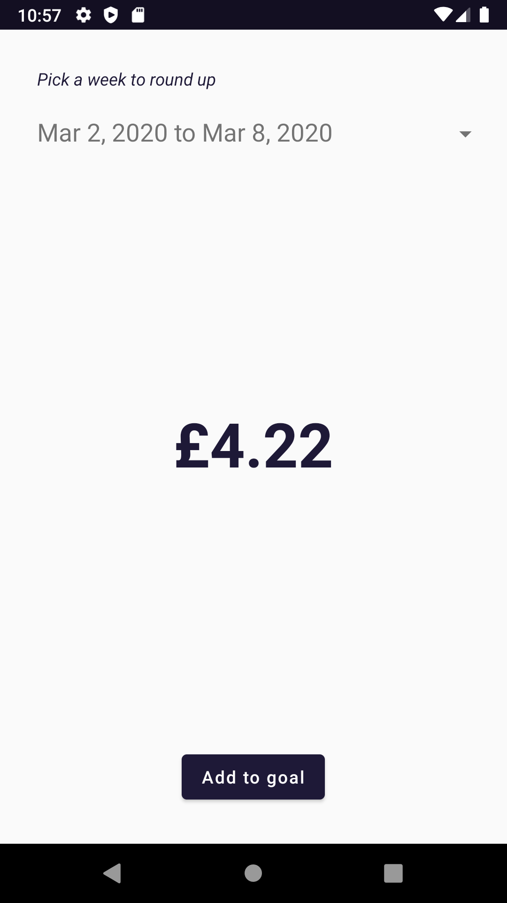

# SavingsGoal
Vesna Lozanovic

# Behaviour
- When the app is launched, user details are retrieved via endpoint /api/v2/accounts and the weeks are calculated for the period from the account creation to the current date.
- When a week is selected all transactions for that week will be retrieved via endpoint /api/v2/feed/account/{accountUid}/category/{categoryUid}/transactions-between  
and the round up will be calculated and displayed in the text view below represented in pounds.  
- After clicking 'Add to goal' a new savings goal will be created via endpoint /api/v2/account/{accountUid}/savings-goals and saved in SharedPreferences unless there is already previously saved savings goal and the round up money will be transferred there via endpoint /api/v2/account/{accountUid}/savings-goals/{savingsGoalUid}/add-money/{transferUid}.
- In case getting account fails, a dialog will be shown.
- If adding to savings goal is successful or fails, appropriate dialog will be shown.

 

    

 

# Access token
The access token is located in app.gradle file as USER_TOKEN buildConfigField.

# Assumptions
- The account and the savings goal are in GBP.
- Only one user is meant to be supported, if the new access token belongs to another user, the app cache has to be deleted
because the savings goal id is saved in SharedPreferences.
- One rounded up week can be added to the savings goal more than once even though in real life it doesn't make much sense.

# Technologies used
- Kotlin
- ViewModel
- RxJava
- Dagger2

# Architecture
I followed clean architecture principles.
- Ui has minimal logic so almost all logic goes through ViewModels.
- ViewModels orchestrate use cases.
- Use cases talk to other use cases or the interface of repository or API.
- There are separate models for data, domain and presentation layer.

# UI/Presentation layer
There is only one activity, MainActivity with 2 ViewModels:
1. WeekSelectionViewModel populates the options for weeks which are since the creation of the account till the current date.
2. RoundUpViewModel calculates roundUp for the selected week and handles 'Add to goal' button.

# Tests
There are only few unit tests at the moment that I needed the most.

